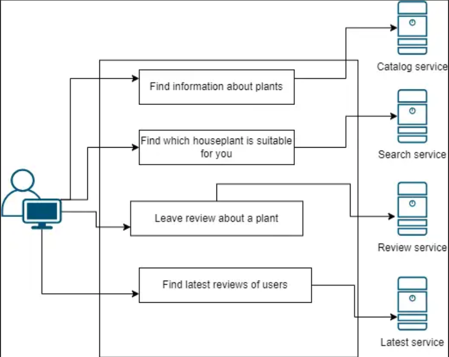
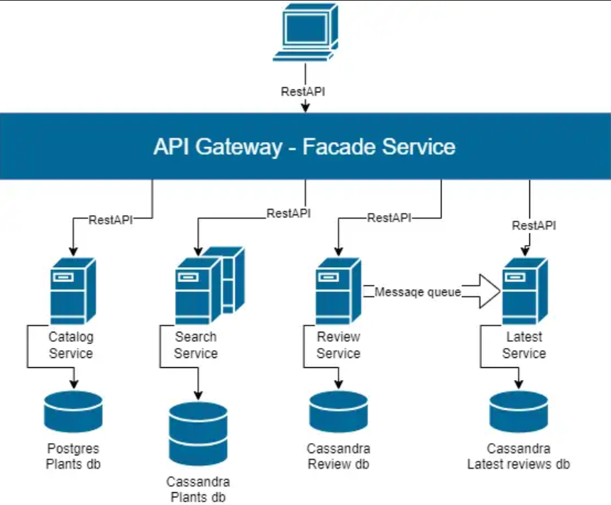

# LeafLoveLaugh

### Команда: Клим Ярослав, Кочеркевич Вікторія, Митник Олексій

## Vision
LeafLoveLaugh - це веб-застосунок, побудований на мікросервісній архітектурі,
основною ціллю якого є створення середовища як для поціновувачів домашніх рослин,
так і для початківців у догляді за рослинами. За допомогою LeafLoveLaugh користувачі 
можуть легко знайти рослинку, що підійде саме їм. Крім того, він створює можливість 
для спільноти обмінюватися відгуками та досвідом, щоб кожен міг знайти оптимальний шлях 
до успішного вирощування рослин у власному домі. 


## Use cases



## Architecture diagram



## Usage:
```
docker-compose up
```
